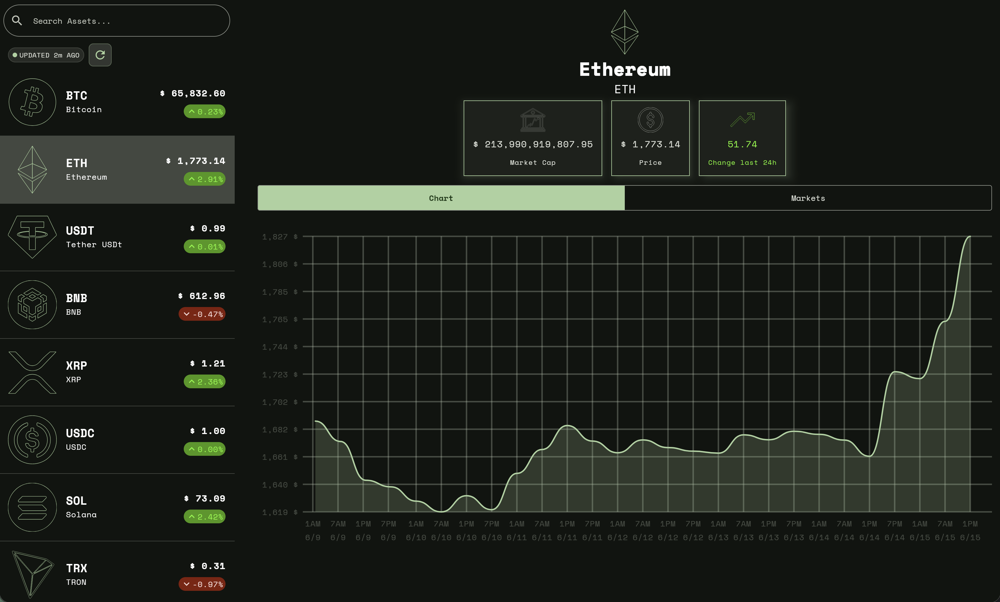

# CryptoTracker — Kotlin Multiplatform

[](https://github.com/DaironDanilo/CrytoTrackerDaniloCMP/actions/workflows/build.yml)
[](https://github.com/DaironDanilo/CrytoTrackerDaniloCMP/actions/workflows/test.yml)
[](https://app.netlify.com/sites/danilo-cryptotracker-kmp/deploys)

## 🌐 Live Demo

**<a href="https://danilo-cryptotracker-kmp.netlify.app/" target="_blank" rel="noopener noreferrer">► Try it in your browser →</a>**

> Runs on any device · No install required · Built with Compose Multiplatform + Kotlin/Wasm

<!-- Replace with your own screenshot taken from https://YOUR_APP.netlify.app -->
<a href="https://danilo-cryptotracker-kmp.netlify.app" target="_blank" rel="noopener noreferrer"></a>

---

A cryptocurrency tracking app built with **Compose Multiplatform 1.11.0**, targeting Android, iOS, Desktop (JVM), and Web (Wasm). It displays live coin prices and historical charts sourced from the [CoinCap](https://pro.coincap.io/api-docs) REST API.

<table>
  <tr>
    <th>Android</th>
    <th>iOS</th>
  </tr>
  <tr>
    <td><video src="https://github.com/user-attachments/assets/addecced-d20f-42d6-a02d-27293ce14f4d"></td>
    <td><video src="https://github.com/user-attachments/assets/d69b64ae-29c7-4c4c-8144-edc40bcc315f"></td>
  </tr>
  <tr>
    <th colspan="2">Desktop</th>
  </tr>
  <tr>
    <td colspan="2"><video src="https://github.com/user-attachments/assets/0e80f837-89d0-407e-a636-1b4a4b92390f"></td>
  </tr>
  <tr>
    <th colspan="2">Web</th>
  </tr>
  <tr>
    <td colspan="2"><video src="https://github.com/user-attachments/assets/48bc0159-ca51-45b8-b8b4-b79aa8e8f44b"></td>
  </tr>
  <tr>
    <th colspan="2">Web — Live on Netlify</th>
  </tr>
  <tr>
    <td colspan="2">
      <a href="https://danilo-cryptotracker-kmp.netlify.app" target="_blank" rel="noopener noreferrer">
        
      </a>
      <div style="text-align: center">
        <a href="https://danilo-cryptotracker-kmp.netlify.app" target="_blank" rel="noopener noreferrer">
            <strong>► Open live demo</strong>
        </a>
      </div>
    </td>
  </tr>
</table>

---

## Features

- Live cryptocurrency list with price and 24 h change
- Coin detail screen with a custom line chart of historical prices
- Adaptive two-pane layout on large screens (tablet / desktop)
- Shared UI and business logic across all four platforms
- Native iOS text input (introduced in CMP 1.11.0)
- Local database cache via Room KMP across all four platforms (Android, iOS, Desktop, Web/OPFS)
- **<a href="https://danilo-cryptotracker-kmp.netlify.app/" target="_blank" rel="noopener noreferrer">Live web demo</a>** — runs in any browser via Kotlin/Wasm, no install required

---

## Tech Stack

| Layer | Library |
|---|---|
| UI | [Compose Multiplatform 1.11.0](https://github.com/JetBrains/compose-multiplatform) · Material 3 |
| Navigation | [Jetpack Compose Navigation](https://developer.android.com/guide/navigation/navigation-compose) · Material 3 Adaptive 1.3.0-beta01 |
| Networking | [Ktor 3.5.0](https://ktor.io/) (OkHttp on Android/Desktop · Darwin on iOS · JS on Web) |
| Serialization | [kotlinx.serialization 1.11.0](https://github.com/Kotlin/kotlinx.serialization) |
| Image loading | [Coil 3.4.0](https://coil-kt.github.io/coil/) |
| DI | [Koin 4.2.1](https://insert-koin.io/) |
| Date/time | [kotlinx-datetime 0.8.0](https://github.com/Kotlin/kotlinx-datetime) |
| Build secrets | [BuildKonfig 0.21.2](https://github.com/yshrsmz/BuildKonfig) |
| Hosting | [Netlify](https://netlify.com) — automatic web deploy on every push to main |

---

## Prerequisites

| Tool | Required version |
|---|---|
| JDK | 17+ (11 minimum; 17+ needed for native desktop packaging) |
| Android Studio | Meerkat (2024.3) or newer — includes the KMP plugin |
| Android SDK | compileSdk **37** · minSdk **24** |
| Xcode | 16+ (macOS only, required for iOS targets) |
| Kotlin Multiplatform plugin | Bundled with Android Studio Meerkat+ |

> **iOS note:** The project supports `iosArm64` (physical device) and `iosSimulatorArm64` (Apple Silicon simulator). The `iosX64` target was removed in CMP 1.11.0.

---

## Setup

### 1. Clone the repository

```bash
git clone https://github.com/DaironDanilo/CrytoTrackerDaniloCMP.git
cd CrytoTrackerDaniloCMP
```

### 2. Obtain a CoinCap API key

1. Go to [pro.coincap.io](https://pro.coincap.io/) and create a free account.
2. Copy your API key from the dashboard.

### 3. Create `secrets.properties`

Create a file named `secrets.properties` in the **root** of the project (it is already listed in `.gitignore` and will never be committed):

```properties
COIN_API_KEY=your_api_key_here
```

The key is injected at build time via [BuildKonfig](https://github.com/yshrsmz/BuildKonfig) and is accessed inside the app as `BuildKonfig.COIN_API_KEY`. Without this file the build will fail.

### 4. Configure Android SDK path (first-time only)

Android Studio usually creates `local.properties` automatically. If it is missing, create it in the project root:

```properties
sdk.dir=/path/to/your/Android/Sdk
```

---

## Running the App

### Android

Open the project in Android Studio and run the **androidApp** configuration, or from the terminal:

```bash
./gradlew :androidApp:installDebug
```

### iOS (macOS only)

Open the project in Android Studio (or Fleet) and run the **iosApp** scheme, which builds the shared framework and launches the Xcode-managed app. Alternatively, open `iosApp/iosApp.xcodeproj` in Xcode and run from there.

Before the first iOS run, set your development team in Xcode:

1. Open `iosApp/iosApp.xcodeproj`
2. Select the **iosApp** target → **Signing & Capabilities**
3. Choose your Apple Developer team

### Desktop (JVM)

```bash
./gradlew :desktopApp:run
```

To produce a distributable package (`.dmg` / `.msi` / `.deb`):

```bash
./gradlew :desktopApp:packageDistributionForCurrentOS
```

### Web (Kotlin/Wasm)

```bash
./gradlew :webApp:wasmJsBrowserDevelopmentRun
```

Open the URL printed in the console (typically `http://localhost:8080`).

---

## Project Structure

```
├── androidApp/                  # Android application entry point
│   └── src/
│       └── main/
│           └── kotlin/          # MainActivity → sets up Koin + Compose
├── iosApp/                      # iOS application entry point
│   └── iosApp.xcodeproj/        # Xcode project — open this to run on iOS
├── shared/                      # Shared KMP library module
│   └── src/
│       ├── commonMain/          # Shared UI, domain, and data code
│       │   └── kotlin/com/cryptodanilo/project/
│       │       ├── core/        # Networking, navigation, utilities
│       │       ├── crypto/      # Feature: coin list & coin detail
│       │       │   ├── data/    # DTOs, mappers, RemoteCoinDataSource
│       │       │   ├── domain/  # Coin, CoinPrice, CoinDataSource
│       │       │   └── presentation/ # ViewModels, State, Actions, Events
│       │       ├── di/          # Koin modules
│       │       └── ui/theme/    # Material 3 theme, colors, typography
│       ├── androidMain/         # Android-specific implementations
│       ├── iosMain/             # iOS-specific implementations
│       ├── desktopMain/         # Desktop-specific implementations
│       └── wasmJsMain/          # Web-specific implementations
├── desktopApp/                  # Desktop application entry point
│   └── src/main/kotlin/         # main.kt → initializes Koin + launches window
├── webApp/                      # Web application entry point
│   └── src/wasmJsMain/          # main.kt + index.html + styles.css
├── kotlin-js-store/             # yarn.lock for Kotlin/Wasm npm deps — committed for reproducible builds
├── gradle/
│   └── libs.versions.toml       # Version catalog
├── secrets.properties           # API key — NOT committed (see .gitignore)
└── local.properties             # Android SDK path — NOT committed
```

### Architecture

The shared module follows a clean architecture with an MVI-inspired presentation layer:

```
UI (Compose) ──► Action ──► ViewModel ──► UseCase / DataSource ──► Ktor / API
                  ◄─── State ◄───────────────────────────────────────────────
                  ◄─── Event (one-shot) ◄──────────────────────────────────
```

- **`domain`** — plain Kotlin models and interfaces (`CoinDataSource`)
- **`data`** — Ktor-based implementation, DTOs, mappers
- **`presentation`** — `ViewModel` + `UiState` + `Action` + `Event` per screen
- **`core/navigation`** — `AdaptiveCoinListDetailPane` uses Material 3 adaptive layout for a responsive two-pane experience on wide screens

---

## Gradle Tasks Reference

| Task | Description |
|---|---|
| `./gradlew :androidApp:installDebug` | Build and install Android debug APK |
| `./gradlew :desktopApp:run` | Run Desktop app |
| `./gradlew :webApp:wasmJsBrowserDevelopmentRun` | Run Web app in browser |
| `./gradlew :desktopApp:packageDistributionForCurrentOS` | Package Desktop distributable |
| `./gradlew build` | Build all targets |
| `./gradlew :webApp:wasmJsBrowserDistribution` | Build production Web bundle (deployed to Netlify) |

---

## Contributing

1. Fork the repository and create a feature branch (`git checkout -b feat/my-feature`).
2. Ensure `secrets.properties` is in place before building.
3. Run the app on at least one target to verify your changes.
4. Open a pull request against `main`.

---

## Credits

Originally inspired by Phillip Lackner's [Android CryptoTracker](https://github.com/philipplackner/CryptoTracker) course. Migrated to Compose Multiplatform with added features including shared element transitions, Desktop, Web (Wasm), and iOS targets.

---

## License

This project is open source. See [LICENSE](LICENSE) for details.